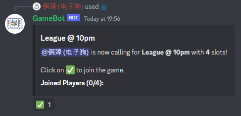

# GameBot
### `Discord` `Python`

Calls a game in your server for your friends to join.

Click [here](https://discord.com/api/oauth2/authorize?client_id=1063820631180845076&permissions=8&scope=bot) to add the bot to your server.

Remember to change your `TOKEN` in `bot.py` if you want to run the bot yourself. You can google for 'how to create a discord bot' for additional guide on setting up the bot.

Usage: **/g `game` `slot`**

`game` stands for the game you want to call, while `slot` stands for the number of slots you want people to join.

